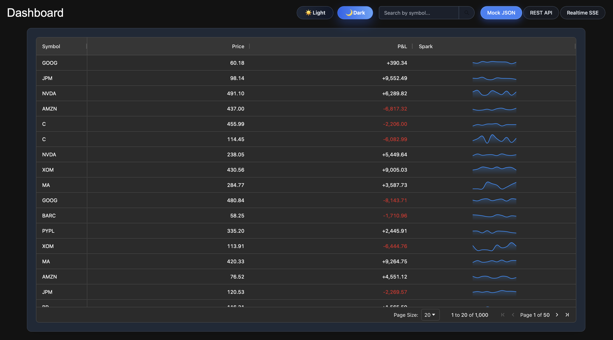

# Mini Dashboard Application

Build a mini-dashboard application for portfolio monitoring with the following requirements:
*	Use React + TypeScript.
*	Display a list of financial instruments (mock JSON dataset provided).
*	Each instrument should show: symbol, price, P&L, and a small trend sparkline.
*	Allow sorting, filtering, and searching by symbol.
*	Implement responsive UI for desktop and mobile.
*	Add a dark mode toggle.



## Features

- **Portfolio Monitoring**: View a list of financial instruments with real-time data.
- **Sorting and Filtering**: Easily sort and filter instruments based on various criteria.
- **Search Functionality**: Search for instruments by symbol.
- **Multiple Data Sources**: Switch between bundled JSON data, a REST API, or realtime SSE updates.
- **Responsive Design**: The application is designed to work on various screen sizes.
- **Dark Mode Toggle**: Switch between light and dark themes for better usability.

## Getting Started

### Prerequisites

- Node.js (version 18 or higher)
- npm (version 9 or higher)

### Installation
   ```
   npm install
   ```

### Running the Application

To start the application in development mode, run:

```
npm run dev
```

The Vite development server runs on http://localhost:5173 by default. Use `npm start` (mapped to `vite dev --host 0.0.0.0 --port 3000`) when developing inside Docker or when the server must bind to all interfaces.

### Configuring the Backend Host

The frontend reads the backend base URL from the `VITE_API_HOST` environment variable. Duplicate the sample file and customise it for your environment:

```
cp .env.example .env
echo "VITE_API_HOST=http://localhost:8001" >> .env
```

When running `npm run dev` the app defaults to `http://localhost:8001` if the variable is not set. Docker builds bake in `https://mfzznc3aac4ed2sjkrvm2ctqje0iukdd.lambda-url.eu-west-2.on.aws` by default, and you can override it by passing `--build-arg VITE_API_HOST=https://api.example.com` when building your image.

### Running Tests

- `npm test` starts Vitest in watch mode.
- `npm run test:run` runs the test suite once (used by the Docker build).
- `npm run test:e2e` executes the Playwright end-to-end suite (run `npx playwright install` once to download browsers).
- `npm run test:e2e:ui` opens the interactive Playwright UI for development and debugging.
- `npm run lint` runs ESLint against the source and end-to-end suites.

### Building for Production

To create a production build of the application, run:

```
npm run build
```

This will generate a `dist` folder with the optimized production files.

### Previewing the Production Build

```
npm run preview
```

This serves the production build locally so you can validate the output.

### TODO
* Add linting and formatting rules

# K8s
Decide if either Service should be NodePort or LoadBalancer based on how you plan to access the apps outside the cluster.
```
kubectl apply --dry-run=client -f kubernetes.yaml.
```
